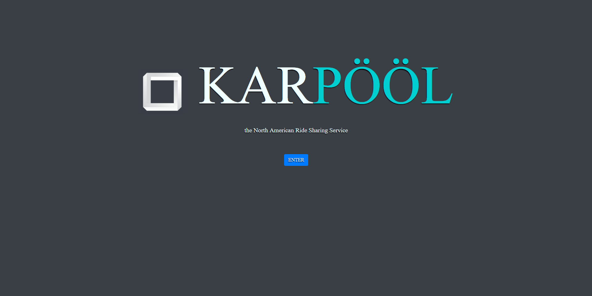

# KARPÖÖL 



> A Vue.js project


# The Web Application
## The Application is comprised of 2 tabs, active and rankings

# Rankings
* displays the active trips within a given time frame upon input of 2 dates and a button press
* The rankings of the top drivers, passengers and destinations are presented upon button press for the same time frame

# Active
* displays all active trips, drivers and passengers
* each table has a dynamic search bar with partial matching to find specific drivers, trip destinations and passengers


## Build Setup

``` bash
# VERY IMPORTANT to install bootstrap as certain buttons make use of this
npm install bootstrap-vue

# install dependencies
npm install

# serve with hot reload at localhost:8080
npm run dev

# build for production with minification
npm run build

# build for production and view the bundle analyzer report
npm run build --report

# run unit tests
npm run unit

# run all tests
npm test
```

For a detailed explanation on how things work, check out the [guide](http://vuejs-templates.github.io/webpack/) and [docs for vue-loader](http://vuejs.github.io/vue-loader).
